# Drone Software Project
_Author: Daniel Cheng_<br>
_Date: 9/2/17 to 9/17/17_

This writeup documents the software development process for [numerate.io](http://ec2-52-11-200-166.us-west-2.compute.amazonaws.com:5000/photos), an automated drone photo service that I built over the course of two weeks. The below analysis details three crucial skills for software project builds: 
* __Project Planning__: Defining user requirements, adjusting timeline as challenges arise, completing MVP
* __Technical Challenges__: Evaluating data structures, learning new tools, solving fundamental CS issues (e.g. multithreading)
* __Software Architecture__: Interfacing with existing APIs, coordinating software components to meet user requirements

[//]: # (include embedded page/screenshot) 
[//]: # (link for dji developer with same issue, other download documentation links)

## Document Outline
1. [Project Planning](#1-Project-Planning)
2. [Evaluation of Existing Tools](#2-Evaluation-of-Existing-Tools)
3. [Android App Development](#3-Android-App-Development)
4. [Flask Web Service](#4-Flask-Web-Service)
5. [Conclusions](#5-COnclusions)

## Project Architecture


## 1. Project Planning 
### Raison D'Etre
Drone adoption has rapidly grown over the last few years, from search-and-rescue missions and aerial surveyance prior to excavation, to automated package delivery and photo shoots for personal enjoyment. 

This project prototypes a new application of drones as photo subscription service. The offered service falls into two categories of high-level user stories. 

__Request a photo now__<br> 
* As a city worker, I want to know how many street parking spots areo open so that I can park in the closest spot to my office
* As a commuter, I want to now how long the line is at my local carpooling stop so that I can decide whether to leave now 
* As a young working professional, I want to know how long the line is at my favorite restaurant so that I can avoid standing in a long line 

__Analyzing historical images__<br>
* As a city engineer, I want to know the daily usage of parking spots so that I can analyze the effect of increasing or decreasing free parking spots 
* As a marketer, I want to understand the demographic distribution of shoppers at IKEA so that I can design more targeted advertisements
[//]: # ( * As a real estate investor, I want to survey properties so that I can evaluate the value of my potential investment)

Hence, this drone service automates photo capture so that subscribers can easily count cars and people in real-time for any location of interest. The above stories were merely a sampling of possible applications--you can easily envision many other situations that would benefit from this drone service.

### Requirements
The above user stories can broken down into the following criteria for a minimum viable product.  

As a user of this drone service, I want to have the ability to:
1. Request a photo capture right now
2. Browse current AND historical images for my location of interest 

### Initial Timeline
To further breakdown the complexity of this project, I defined the following timeline for completing each project component over the next 16 days.

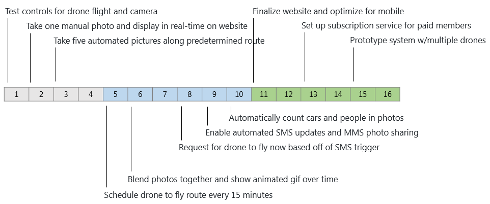

_Note:_ All of this was planned as a prototype for purely recreational purposes. Further development into a commercial product would require consideration of FAA regulations around drone flight.

### Anticipated Roadblocks 
Having done initial research into consumer drone capabilities, I knew that it was possible to automate taking photos and flying predetermined flight routes. In my searches, I had found numerous drone apps that appeared to have these capabilities (discussed in further detail in the next section). Thus the work for days 1 through 4 seemed to merely be a matter of execution.

However, I had found no examples of consumers apps allowing for scheduled or triggered missions. I suspected there were potential safety concerns--as well as less demand for this in the hobbyist market (i.e. unless you are flying drones commercially, it seems unlikely that you would need to have fully automated scheduled drone flights). 

If by Day 5 in my timeline, I indeed could not find an existing product for scheduling drone flight, I had two alternate plans:
1. Build a customized app using [DJI's mobile SDK](https://developer.dji.com/mobile-sdk/)
2. Plan for having a manual release of the drone by a human worker. No matter how automated, this drone service would likely need some human intervention to maintain

## 2. Evaluation of Existing Tools 
### Hardware Justification
For this project, I chose to use a DJI drone for two reasons. First, DJI is the clear leader in the consumer drone space, owning perhaps [50% of the North American market](https://www.recode.net/2017/4/14/14690576/drone-market-share-growth-charts-dji-forecast). My project was focused on software rather than hardware--so I wanted to pick the most reliable hardware available, thus avoiding having to troubleshoot flight control or camera issues.

Secondly, DJI offer [programmatic control](https://developer.dji.com/mobile-sdk/documentation/introduction/mobile_sdk_introduction.html) of its drones, opening up the possibility of advanced customized control over the drone's flight. 

Among the DJI drones, I selected the Mavic Pro because of its popularity in taking high-quality aerial photography. As a middle-tier drone, the Mavic Pro also automates many parts of drone piloting, from takeoff and landing to obstacle avoidance and intelligent flight modes. Again, the focus of this project was on software and not on hardware--hence I wanted to select a drone that would automate as much of the piloting experience as possible. 

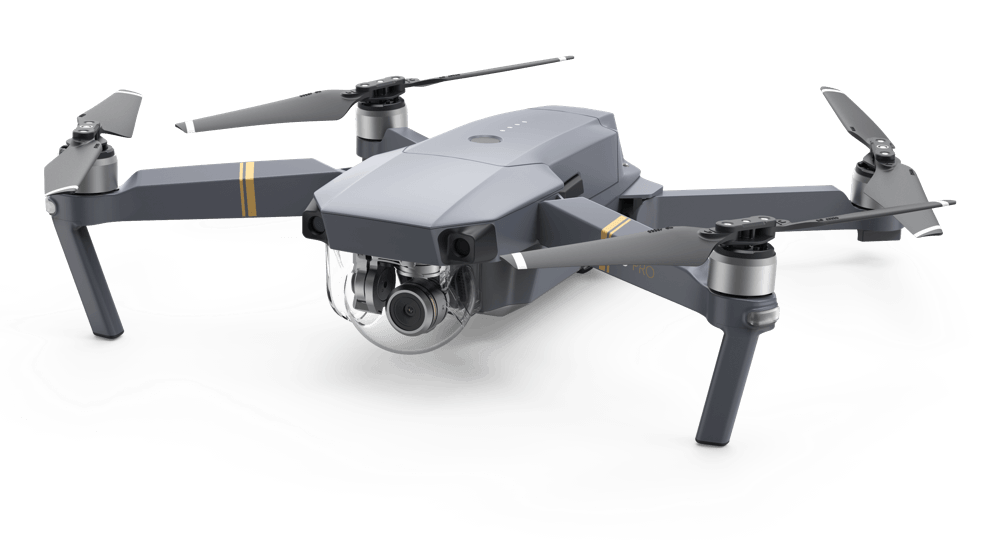
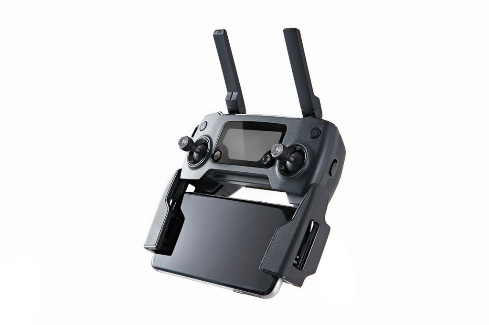
<br>

_Note_: For those unfamiliar with drones, you control the drone aircraft (left image) using a remote controller (right image), which transmits commands at 2.4 to 2.483 GHz. You then connect your phone to the remote controller, allowing you to not only issue commands directly from an app, but to also view a live camera feed of the drone's point of view.

### Downloading Photos
For the first two days, I experimented with the basics of flying a drone and taking photos. I first confirmed that the image quality was more than sufficient for my photo service (the photos came out as 12000 MP, a resolution far higher than most web browsers need for rendering). Secondly, I tested flying simple automated flights ("missions").

During this phase, I ran into a roadblock with displaying the drone image in real-time on a website. When a photo is captured, the drone only stores the images on the SD card loaded on the physicial aircraft. However, I needed to download those photos from the aircraft to my mobile device--so that I could then immediately push those photos to my web server. Otherwise, the images would remain stuck on the aircraft until it landed. Furthermore, this image download had to occur programmatically, so that scheduled and triggered flights could push images automatically without any human intervention.

Hence, to deliver on this feature, I sought out a DJI mobile app that could reliably download all images captured during a flight to local phone storage. Photos could then be pushed (using an app like [BotSync] (https://play.google.com/store/apps/details?id=com.botsync)) to the EC2 hosting my web server. 

Should this prove impossible, I had a backup plan to install an Eyefi card on the aircraft--so that at the very least, images could automatically transmit once the drone landed in the wifi area. This would incur a slight delay in streaming to the website, but this would still allow for fully automated upload of images without human intervention.
 
### Comparison of Drone Apps 
Given my first two days of drone exploration, I now focused my efforts on finding an existing mobile app providing functionality to:
1. Take photos while automatically flying a preset flight path (mission)
2. Download photos to phone
3. Schedule and/or trigger missions 

You may ask why I did not immediately attempt to write my own mobile app to accomplish all of my required features. In software development, it is better practice to first use existing libraries and packages instead of writing your own custom solution. First, this can save significant time if you can simply plug in an existing app into your own custom architecture. Secondly, prebuilt libraries are usually better tested, having gone through multiple iterations before being shared for general use. 

Hence, I wanted to exhaust existing solutions that could achieve the above three criteria, before considering alternate solutions (such as writing my own mobile application). 

[//]: # (check spelling, cost, system availability)

#### Native DJI GO App
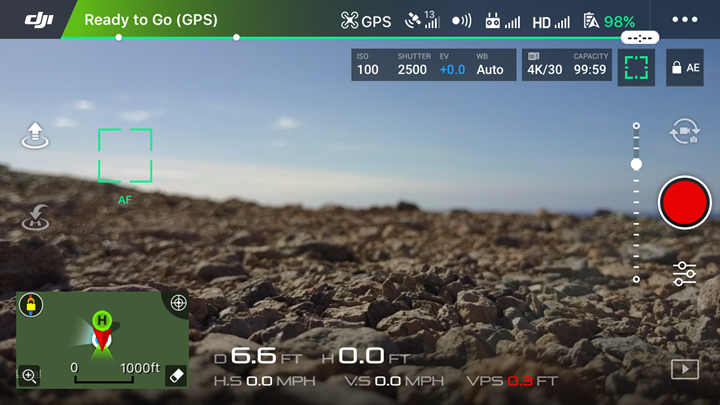

DJI provides its own [DJI GO App](https://www.dji.com/goapp) when flying its drones. This app runs comprehensive startup validation (e.g. compass calibrated, GPS connected), then offers a full suite of in-flight controls, including:
* Single shot, timed shot, and video capture 
* Camera tuning (adjusting focus, exposure, and orientation) 
* Photo caching (download photos to phone storage) 
* Waypoint missions (automatically flying the drone along a predetermined set of GPS coordinates)

Thus the DJI GO App fulfills criteria #2 (download photos), but only partially achieves criteria #1 (automated mission). Although the app could automatically fly the drone along previously visited waypoints, it could not automate photo capture throughout the mission. 

As it turns out, the majority of other consumer apps allow for more advanced control over waypoint missions (criteria #2), but fail to allow for photo downloading (criteria #1). The next section evaluates these feature tradeoffs amongst the most popular DJI drone apps. 

#### Category 1: Hobbyist Apps for Recreational Photography
This first set of apps targets the drone enthusiast market who fly drones solely for personal recreation. In increasing order of price:
1. Airnest 
2. DJI Ultimate Flight
3. Litchi
4. Autopilot

<br>__Airnest__<br>
The [Airnest app](http://www.airnest.com/) is marketed as simply and easy to use with a "Photostop style" interface. For example, for waypoint missions, the app allows users to simply "paint a line" on a map, and the app converts that into mission instructions for the drone.

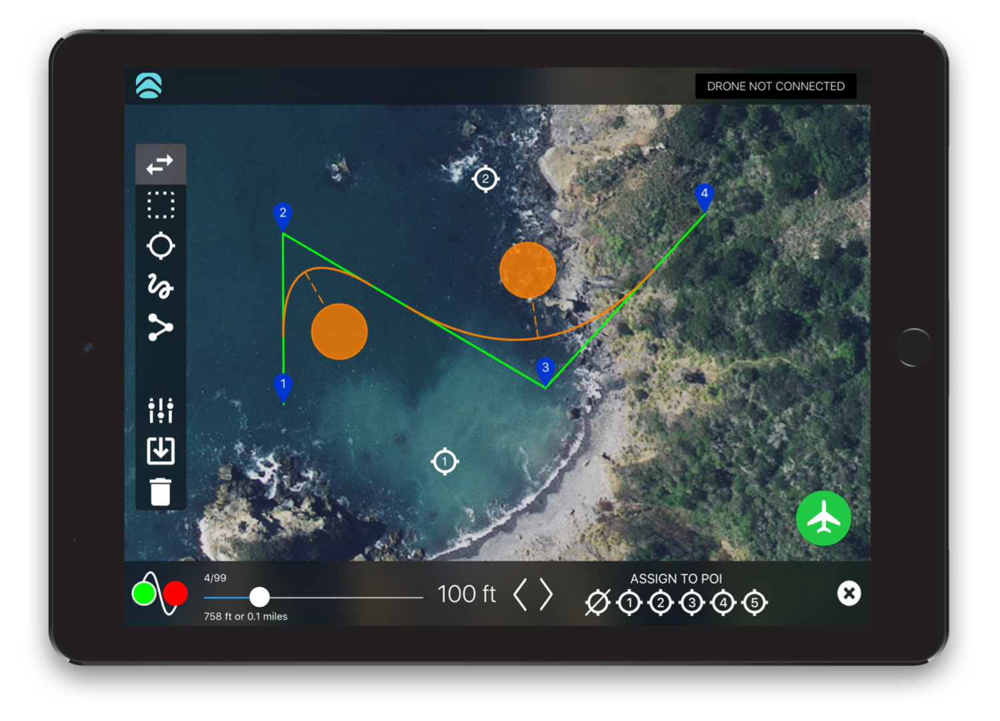<br>

In my user tests, the app unfortunately failed to live up to its promise of being extraordinarily simple and easy to use. Missions could indeed be drawn with the flick of a finger, but editing those missions proved nearly impossible. For example, when I attempted adjust the auto-generated waypoint, I could find only one exact pixel spot where the app would respond to my touch.

Airnest does offer other features for more serious drone enthusiasts, such as flight logging, playback, and health metrics. As a free app, Airnest provides perhaps the best value for a drone hobbyist wishing for customization beyond the native DJI Go App. 

<br>__DJI Ultimate Flight and Litchi__<br>
These next two apps offer very similar features, with [DJI Ultimate Flight](http://djiultimateflight.com/) coming in at $20, and [Litchi](https://flylitchi.com/) at $23-25 depending on the system. These two are the most popular DJI drone apps mentioned in drone enthusiast forums and sites.

The app layout mimics the DJI Go4 App, with a first-person video stream in front, camera options on the side, and toggle menus for capture settings, waypoint behavior, etc.

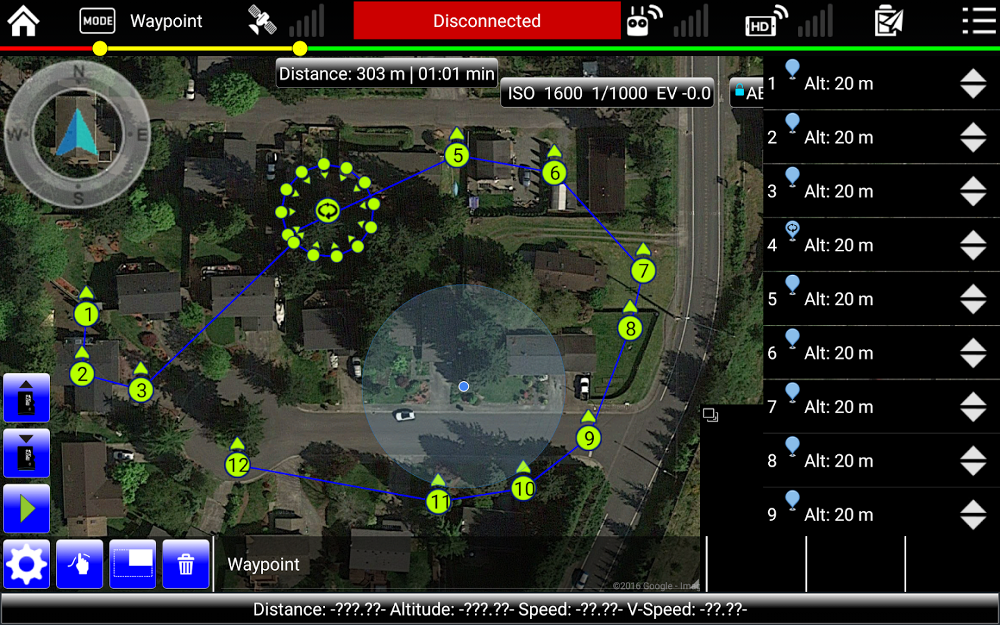

Users can create far more customized and automated missions than would be possible in the native DJI app. This includes:
* Taking pictures (single shot and timed shot) at a waypoint
* Recording video at a waypoint
* Rotating the camera to focus on a point of interest 
* Pausing and hovering at a waypoint

Users simply tap on the map to create a waypoint, then add any of the above actions to that waypoint. A series of such waypoints are then uploaded as a mission to the drone. All that's left is to hit "Run Mission" and the app will fly the drone from start to finish!


Hence, DJI Ultimate Flight and Litchi fulfill criteria #2 (automated mission with photos). However, these apps fail to meet criteria #1 (download pictures automatically). Litchi does offer photo caching on iOS, but this feature is not avialable during waypoint missions.

For example, for the waypoint missions, these apps allow you to mark destinations on a map, then convert these into a drone mission--unlike the DJI Go4 App which requires you to fly the drone through all these destinations before rerunning.

<br>__Autopilot__<br>
[Autopilot](https://autoflight.hangar.com/) is by far the most advanced hobbyist app on the market. Users can precisely control every aspect of automated drone flight, from the exact camera angle and focus to the curvature and descent of flight between waypoints. Autopilot also offers tracking of other drones within the area, on top of flight recording and logging.

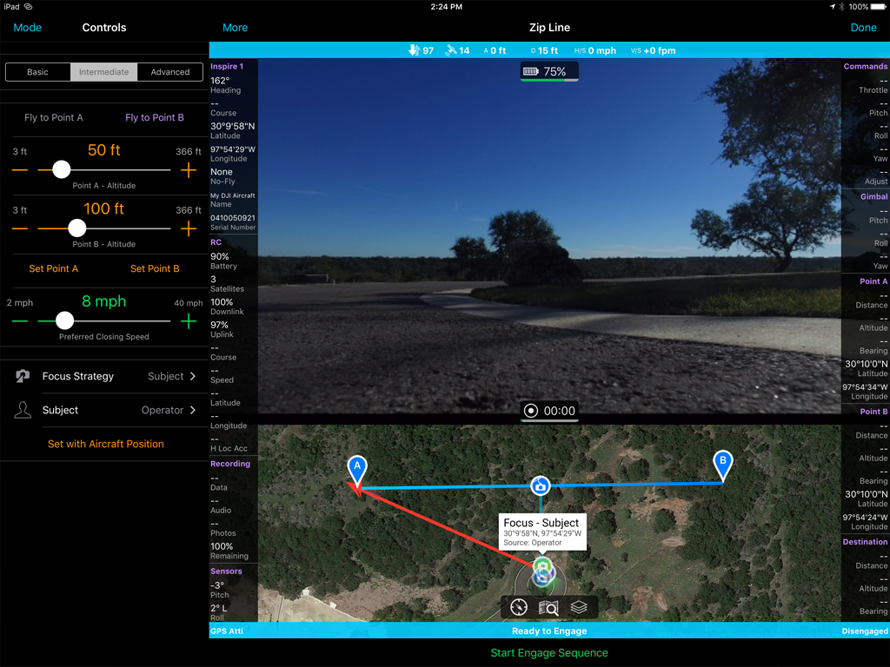

The priciest of all these apps ($29.99), Autopilot is ideally suited for those who need advanced automated flight control beyond what Litchi and DJI Ultimate Flight can offer. The learning curve is steeper due to the increased complexity offered for mission planning.

Despite its advanced features, Autopilot does not offer automatic photo download either during waypoint missions, hence failing criteria #2.

#### Category 2: Commercial Apps for Surveying and Mapping
This second set of apps targets professional or enterprise customers who fly drones to survey and map landscapes. These apps enable users to automate flight paths for large areas of land: Mark a rectangular grid on the map, and the app will automatically calculate the path, speed, and frequency of photo capture.

Thus, instead of allowing users to customize every point along the mission, these apps determine the optimal path so that the resulting photos can be used to generate high-resolution stitched images and 3D models of the landscape. In increasing order of cost:
1. PrecisionFlight
2. Pix4Dcapture
3. DroneDeploy

<br>__PrecisionFlight__<br>
Deployed by PrecisionHawk, this free [PrecisionFlight app](http://www.precisionhawk.com/precisionflight) is straightforward to use: Simply touch and drag to mark the survey area on the map, then the app will automatically generate a waypoint mission to fly. There are no additional capabilities for customizing camera focus or gimbal rotation--the app simply flies the drone over the desired area and captures the images required to generate a high-resolution image of the area.
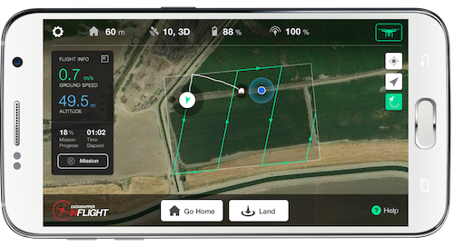

<br>__Pix4Dcapture__<br>
Another free app, [Pix4Dcapture](https://pix4d.com/product/pix4dcapture/), offers more control over missions than FlyingPrecision does. Upon opening the app, users select from various mission layouts to suit their surveying needs.
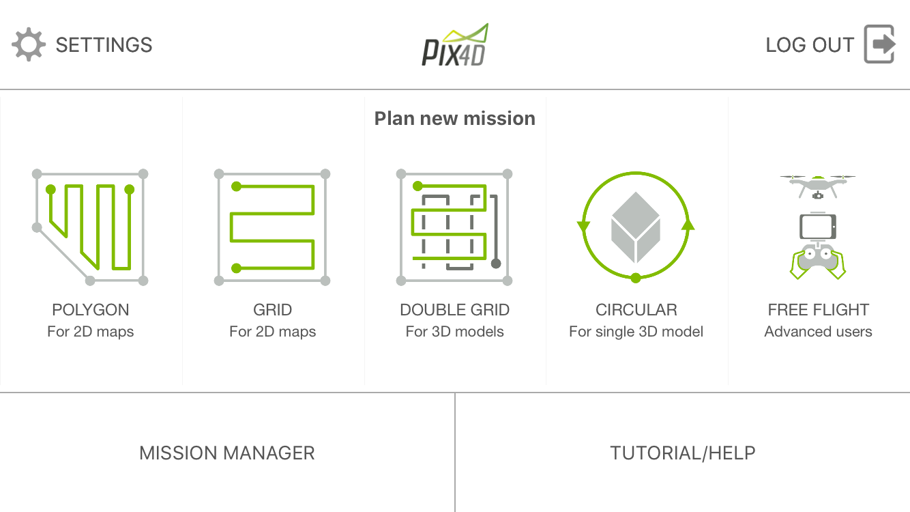

As evident in the above screenshot, everything in the app is geared towards the post-processing stage, in which photos are transformed into 2D maps and 3D models. In the words of one of the supported reps that I contacted regarding this app:
> Pix4Dcapture is a great flight planning app we provide free [but] you are free to use other applications if they better suit your needs. It is our Pix4Dmapper software that is the premier solution for photogrammetry, and as long as you are able to capture your images with the correct overlap and quality, you can process with Pix4Dmapper. 

Among the apps I surveyed, Pix4D was the only one that offered complete functional photo caching on both Android and iOS. Upon mission completion, all photos are streamed to the corresponding mission folder on internal storage, before being uploaded to Pix4D cloud for 3D modeling.

<br>__DroneDeploy__<br>
The [DroneDeploy](https://www.dronedeploy.com/app.html) app lands users on a demo mission showcasing the app's ability to map a large Midwest farm. Offering a free Explorer tier followed by a $99 per month Pro tier, DroneDeploy offers the most advanced mapping features of all apps considered. This includes automatic area and volume measurements, NDVI calculations, and 3D exports. 

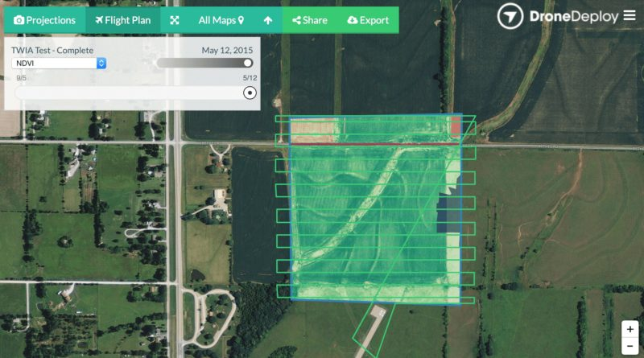

Although DroneDeploy offered perhaps the best mapping features on the app market, I ran into similar issues with photo caching, in which the app automatically generated hundreds for photos for a mission, but required manual extraction of images from the SD card in order to process. 

### Conclusion of Drone App Evaluation 
After thoroughly testing all of these drone apps, I concluded that no existing app could fulfill the minimum criteria necessary for my drone service.

Litchi came closest with its mission planning interface and automated flights, but failed to offer photo downloading during missions--essential for immediate streaming to my website. 

Pix4D was a close second since it automatically downloaded images to the phone upon completion of the mission, but its mission planning was not flexible enough for my needs. Because the app was meant for surveying a region, the quality and rate of image capture was locked away in a black box--hence I had no ability to customize taking pictures at different angles and speeds. 

Finally, none of the apps offered a way to schedule or trigger a mission (through a medium like SMS). Ultimately, you would still have to manually press a button to start the mission.

__***Hence, I now had to rapidly pivot from my original development plan and build my own Android app to fulfill the project requirements.***__ 

## 3. Android App Development
### Minimum Requirements
Given the limited timeframe, I needed to carefully identify the exact requirements for my custom app. I was _not_ designing a user-facing app like Litchi, with a complete UI, product validation, forms for custom missions, and so on. Rather, I only had to build the following list of features: 

_Rebuilding Features Available in Existing Apps_<br>
* __Mission Automation__: Take off from ground, fly preset route while taking photos, then return home and land 
* __Photo Download__: Photos should automatically download to the phone's internal storage 
* __Image Quality__: Camera should auto focus throughout to ensure quality photos

_Adding New Features_<br> 
* __Scheduled Missions__: Schedule a mission to run every 5/10/15 minutes
* __Triggered Missions__: Use SMS to trigger the mission
* __Photo Transfer__: Push downloaded photos to EC2 server
* __Photo Compression__: Reduce photo size from 5 MB to 0.5 MB to speed up transfer


### Problem Scoping: Evaluating the Mobile SDK
Before jumping into coding all of these functions, I first identified how each requirement mapped to an existing class or method in the [DJI mobile SDK](https://developer.dji.com/mobile-sdk/documentation/introduction/index.html). For any software engineering project, it is a best practice to evaluate the feasibility of each component beforehand--instead of discovering halfway through the project that the most crucial part is not possible. 

Feature | DJI SDK Class | DJI SDK Method
------- | --------- | ----------
Mission Automation | MissionBuilder | addWaypoint, addAction, loadMission, startMission 
Photo Download | MediaManager | onNewFile, fetchFileData
Image Quality | Camera | setFocusmode

Feature | Android Package
------- | ---------------
Scheduled Missions | Timer
Triggered Missions | BroadcastReceiver / SMS Manager
Photo Compression | ImageUtil
Photo Transfer| JSch

During this phase, I reviewed the sample [DJI tutorials](https://developer.dji.com/mobile-sdk/documentation/introduction/index.html), then identified troubleshooting resources, such as the [DJI developer forum] (http://forum.dev.dji.com) and [DJI posts on Stack Overflow] (https://stackoverflow.com/questions/tagged/dji-sdk). I also contacted DJI support to validate the most essential feature for my app (i.e. that photos could be automatically downloaded during mission execution).

### Revised Timeline 
Once I determined that the DJI mobile SDK could implement all of my required features, I adjusted my initial timeline to account for the effort required to write an Android application. 

At this point, six days had elapsed already. Given that I had not worked with Android before, an initial prototype would take, at minimum, three days--and a would likely take closer to five or six days to iron out any bugs. Hence, to accommodate app development, I had to eliminate several features in my initial timeline, including:
* Automated MMS photo sharing 
* Setting up subscription service 
* Prototyping system for multiple drones 

These were nice-to-have features in a beta version of the app--but were not necessary for the alpha version. Recall the requirements for this drone service:
> 1. Request a photo capture right now
> 2. Browse current AND historical images for my location of interest 

Hence I chose to divert the majority of my remaining time into this custom Android app, to ensure I could achieve the above two criteria. 

Finally, I also deprioritized writing code to automatically parse and count cars in these drone images. This was again a nice-to-have feature, but not strictly necessary. For example, users of this service could easily take a look at a photo of street parking and tell if any parking spots were open. Automatic object recognition was not strictly necessary for the success of this project prototype.  

Thus my revised timeline was as follows: 

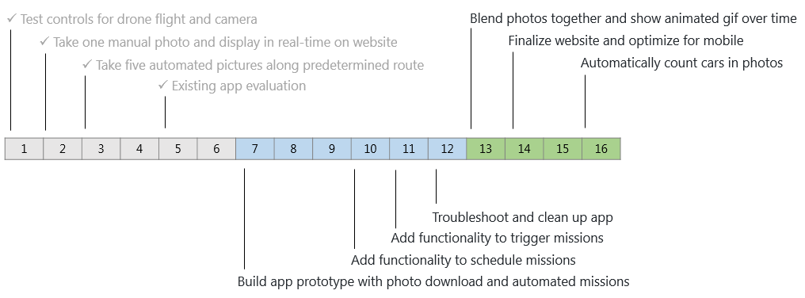

### Software Build 
I chose Android as the development platform for two reasons:
1. __Existing Hardware__: I had an Android phone readily available for installing and debugging 
2. __Developer Control__: I valued Android having more flexibility than iOS (e.g. having more control to save photos in any folder of the file system, having the ability to publish app directly to the Marketplace)

As I had no direct Android app development experience--and given the limited timeframe for project completion--I copied the existing codebase from DJI's [QuickStart Guide](https://developer.dji.com/mobile-sdk/documentation/quick-start/index.html) and [camera tutorial](https://developer.dji.com/mobile-sdk/documentation/android-tutorials/index.html). Rather than spending my limited time setting up product registration, drone connectivity, and live-camera streaming, I simply enhanced the existing tutorial to address my needs.

Below is a breakdown of which app features were successfully completed by project day:<br>
__Day 7__:
<br>[x] Compile and run tutorials 
<br>[x] Set up live video stream 
<br>[x] Create button to take a photo during drone flight
<br>[x] Troubleshoot Android permissions (requested at runtime instead of on install for >= Marshmallow)

__Day 8__:  
<br>[x] Set optimal focus for photos
<br>[x] Automatically take off
<br>[x] Automatically land 
<br>[x] Download photos to internal storage 

__Day 9__:
<br>[x] Add waypoints based on GPS coordinates
<br>[x] Add custom actions at each waypoint (start timed shot, rotate gimbal, etc.) 
<br>[x] Upload multiple waypoints as one mission to the flight controller 

__Day 10__:
<br>[x] Create timer to trigger mission every 5/10/15 minutes 
<br>[x] Create broadcast receiver to listen for SMS trigger kicking off mission 
<br>[x] Test complete execution of mission with automatic timed shots 

__Day 11__:
<br>[x] Resize images from 5 MB to 0.2 MB 
<br>[x] Post resized images to EC2 server backend 
<br>[x] Save photos in timestamped mission folder (locally and on server)
<br>[x] Test complete execution of mission 

__Days 12 - 14__: 
<br>[x] Troubleshoot multithreading and bandwidth issues with downloading photos 

As evident in the above timeline, I completed the app prototype within the expected timeframe of five days, but I ran into an unexpected technical challenge with downloading photos that required several additional days to troubleshoot. 


### Technical Challenges: Multithreading and Synchronization for Photo Downloads
#### Debugging: Hypotheses 
During my first code iteration, I used callbacks to automatically triggered photo download to local phone storage. That is, whenever the DJI camera app generated a new photo, it would automatically start downloading the photo:
```java 
camera.setMediaFileCallback(new MediaFile.Callback() {
    @Override
    public void onNewFile(MediaFile mediaFile) {
        mediaFile.fetchFileData(new File(mDownloadPath + "/" + subfolder), filenameNoExtension, new DownloadListener<String>() {
            @Override
            public void onStart() {
            }
            public void onSuccess(String s) {
            }
            public void onFailure(String s) {
            }
            
        }
    }
}
```
I first tested this download feature on a DJI simulator, in which I connect the drone to my computer and fly virtual missions. This initial test showed that all 10-20 photos were captured and downloaded automatically throughout mission flight.

However, upon testing the exact same missions outside, only the first 5 or 6 images would download. The rest would raise a timeout error and block all subsequent downloads.

I had two hypotheses for debugging this failure to download all photos:
* __Transmission Distance__: Failure due to increased distance between controller and drone whenflying outdoors
* __Limited Bandwidth__: Failure due to limited CPU or bandwidth for downloading photos

To test the first hypothesis, I replaced the individual callbacks with a batch download of all images after the mission completed (hence the drone had returned to within a few feet of the controller). Yet despite this adjustment, I still ran into similar download issues.

Hence, I moved onto the second hypothesis. When photo downloading failed, the logs from the download listener indicated that "the resource was too busy executing other commands." This indicated the following: Because photos were automatically downloading off of a callback--and because images were being shot every two seconds--all available bandwidth was consumed by the first 5 or 6 images, thus starving any new requests for downloading.

I further validated this hypothesis based off similar problems encountered by a developer in the [DJI forum](http://forum.dev.dji.com). Furthermore, the DJI SDK offered a [task scheduler class](https://developer.dji.com/api-reference/android-api/Components/Camera/DJIMediaManager_FetchMediaTaskScheduler.html?) for fetching _previews_ of images--effectively implementing a queue to manage downloads one at a time. This again suggested that the _full resolution_ photos had to be downloaded one at a time due to limited transmission bandwidth.

The astute reader might question why this error happened only when flying outside--and not when flying virtually on the simulator. While testing the first hypothesis, I already validated that the _distance_ from controller to aircraft did not affect the download success rate. This indicated to me that a second issue might be at play.

When building software projects, one typically executes tests in one of the three classes:
1. __Fault Testing__: The program should correctly executes its intended function 
2. __Stability Testing__: The program should reliably execute its function as frequently as possible (even if one or two cases fail)
3. __Stress Testing__: The program should execute properly when scaled up to production level

It appeared that my automatic photo download failed stress testing because the simulator environment did not fully capture the load during production (i.e. when flying outside). Specifically: additional load came from the app directing the flight controller to physically move and maintain the drone's flight. This hypothesis was further supported by [CPU monitoring apps](https://play.google.com/store/apps/details?id=com.glgjing.stark&hl=en) which indicated high CPU usage when I flew my drone.

Since the Android system can [pause or destroy app components](https://developer.android.com/topic/libraries/architecture/guide.html) to rebalance resources, I suspected that the total bandwidth was being constrained by my phone's operating system. Flying outside increased overall system load and triggered this system resource management--hence killing or reducing total resources available to the background thread responsible for downloading photos.

#### Solution
To properly manage the limited bandwidth for downloading media files using the DJI SDK, I applied two software techniques:
1. Maintain a queue of downloads 
2. Apply a mutex to prevent multithreaded callbacks  

Regarding resources being constrained by my phone's operating system, I force killed all other applications in my subsequent tests to minimize the chance of Android diverting resources from my app towards other apps. If this issue persisted, I planned to move my testing to an upgraded Android phone.

For the remainder of this section, I will focus on how I implemented the queue and mutex. Implementing the queue was as simple as adding new files into an array list. This array list was an instance variable to allow for persistence across multiple file callbacks:
```java 
camera.setMediaFileCallback(new MediaFile.Callback() {
    @Override
    public void onNewFile(MediaFile mediaFile) {
        addNewMediaFileToQueue(mediaFile);
    }
}
private void addNewMediaFileToQueue(MediaFile mediaFile) {
    mMediaFilesToDownload.add(mediaFile);
}
```

Queuing file was simple; but simply dequeueing element by element and calling the download method failed.
```java
while(!mMediaFilesToDownload.isEmpty()) {
    MediaFile mediaFile = mMediaFilesToDownload.remove(mMediaFilesToDownload.size());
    downloadOneMediaFile(mediaFile, label);
}
``` 
Because array lists are not synchronized structures, multiple threads were removing files from the queue, which not only cause concurrent write conflicts, but also resulted in multiple downloads executing in parallel. This defeated the goal of having sequential downloads in order to manage bandwidth.

This was easily remedied by either (1) making the method synchronized, or (2) iterating over the array list without removing the files. 
```java
int n = 0;
while(true) {
    // use break condition instead of embedding in while condition, 
    // in case images are added to queue during loop iteration
    if (n >= mMediaFilesToDownload.size())
        break;
    MediaFile mediaFile = mMediaFilesToDownload.get(n);
    // avoid repeated download if method is called again 
    if (!mMediaFileNamesDownloaded.contains(mediaFile.getFileName())) {
        downloadOneMediaFile(mediaFile);
    }
    n++;
}
```

However, this dequeueing approach still failed to prevent overloaded download bandwidth because the SDK download was executed as a callback. Thus, even though files were dequeued sequentially, one at a time, the callbacks could end up executing simultaneously on the background thread.

Hence, to solve this, I implemented a mutex so that only one file could be downloading at any given time. This guaranteed that even if multiple callbacks were triggered, only one file could download at once--hence ensuring sufficient download bandwidth.

Note that although this solution executed more slowly than downloading multiple files in parallel, this solution was far more reliable--a far more valuable feature for my product, as I needed to guarantee successful load of all images to the server.

```java   
mediaFile.fetchFileData(new File(mDownloadPath + "/" + subfolder), filenameNoExtension, new DownloadListener<String>() {
    @Override
    public void onStart() {
        mMediaDownloadOneFileLock.lock();
    }
    public void onSuccess(String s) {
        try {
            // resize image (abridged code shown below)
            resizer.resize(mDownloadPath + "/" + subfolder + "/" + filename, mResizePath + "/" + subfolder);

            // SCP to EC2 server (abridged code shown below)
            scpCopyInBackground.execute(params);            
        } catch (IOException e) {
            e.printStackTrace();
        } finally {
            mMediaDownloadOneFileLock.unlock();
        }
    }
    public void onFailure(String s) {
        mMediaDownloadOneFileLock.unlock();
    }
}
```
   
### Final Architecture of Android App
//replace with zoomed in view of diagram 
* Image Resize
* ScpTo
* SMS Processor
* Custom exceptions
* Waypoint mission flying
* Live video feed

// TBD: insert screenshot of app here 

## 4. Flask Web Service
After troubleshooting the photo download issue described above, I had just over a day left to build the front-end web service for displaying the drone images. Given the tight timeline, I identified the following  minimum criteria for completion. You'll notice that this lists excludes automatic counting of cars within the images: As I mentioned before, this was a useful but not necessary feature of my envisioned service, and hence I chose to drop this so that I could deliver on the most crucial features.
* Automatic refresh of latest images from drone 
* Fast historical image browsing 
* Responsive on web and mobile 

### Architecture Design
From a technical perspective, I broke down my remaining work into the following components:
1. __Image Processing__: Stitch and stack photos 
2. __Flask Server__: Find latest images and display on site
3. __Front-End UI__: Optimize for both web and mobile 

I also sketched out the below architecture from my custom mobile app to the final front-end browser.

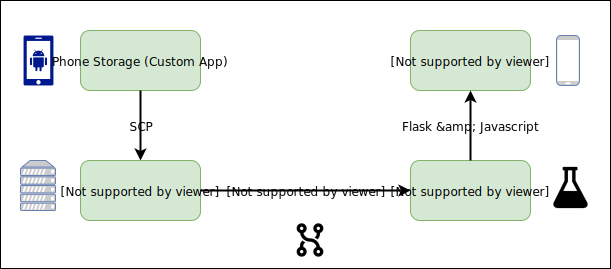


### 4.1 Image Processing 
For certain missions (e.g. taking photos of parking along a long narrow street), the drone takes a series of timed shots, in expectation that  these photos will be stacked and "stitched" together to construct a final blended photo of the street (similar to a panorama).

For this task, I selected Hugin, an open source photo processing package, because it fulfilled the two minimum requirements for stitching:
1. __Input Flexibility__: Any number of images could be correctly blended into one final image 
2. __Automation__: All stitching could be automated in a command line script

Regarding the second point, Hugin offers Hugin Executor, a command line utility for stitching, aligning, and processing photos. Stitching is achieved by calling various other photo processing packages, such as nona, enblend, and cpfind that execute blending algorithms. 

The one unforeseen problem with Hugin Executor was its requirements for high CPU usage, which exceeded the capacity of the EC2 I used for hosting. One solution was to simply upgrade the EC2, but I chose instead to write a simple script to cap CPU usage by Hugin and all its derivative processors. Even on a larger box, I would still need some way to guarantee that Hugin did not consume too much compute power; hence limiting CPU was the simplest and fastest solution towards a viable product.

```bash
nohup cpulimit --exe=/usr/bin/hugin_executor --limit=75 &
disown

nohup cpulimit --exe=/usr/bin/nona --limit=75 &
disown
[...]
```

Finally, post-stitching in Hugin, I used the Python OpenCV library to clean up the images, including compressing and converting Hugin output tif to jpeg images.

### 4.2 Flask Hosting
Having solved the problem of cleaning and stacking photos, I now had to structure my backend image repository in such a way that the Flask server could:
1. Quickly identify the latest new images 
2. Automatically group and sort photos by date and time for iterating inside of Flask templates

To achieve the first requirement, I nested images within a mission-date-time hierarchy. I first pushed images from Android local storage to the SCP share location, saving them within this mission-date-time folder hierarchy. I then set up an identical nested structure in the Flask server images subfolder. To determine new mission executions since the last refresh, I simply merged the two folder listings and processed any folder names appearing in the SCP share location but not in the Flask images location. 

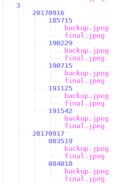

To achieve the second requirement, I determined the following one-to-one correspondence between folder level and Flask object.
* Mission folder --> One webpage of photos 
* Date folder --> Section within a webpage 
* Time folder --> Images in a slideshow within the same section 

Because of this hierarchy, it was simple to iterate within a Flask template and generate this front-end functionality for users:
1. Toggle between photos for each mission 
2. Scroll down a mission page and view pictures grouped by day 
3. Browse within a day and view pictures sorted by timestamp 


### 4.3 Front End 
To display the mission images in a clean user-friendly interface, I utilized bootstrap for basic styling. This also ensured responsiveness across web and movile. 

I then coded Javascript functions so that users could:
1. Click and zoom in on images (pinch and zoom on mobile) 
2. Click to browse pictures sorted by timestamp within a given day 
3. Click to animate the photos (essentially showing a gif within a given day) 

Finally, because Flask does not enable auto refreshing of a page from the back-end server, I implemented a Javascript callback to trigger a refresh every 60 seconds. While not ideal, this solution sufficed for this prototype. Future iterations can implement a method to selectively refresh the latest new image rather than running a full page refresh. 

## 5. Conclusion
### Future Work 
My next iteration of this drone service would implement the following features from my backlog: 
* Automatically parse and count cars in the drone images 
* Send MMS of images from the latest executed mission 
* Set up a members subscription service for requesting drone to fly mission right now 

Should this prove successful, I would then scale this up: 
* Identify other points of interest for taking photos 
* Prototype software to coordinate and schedule multiple drones flying throughout the day 
* Solve hardware constraints e.g. recharging/swapping batteries

The last point speaks to the difficulty with almost all consumer drones: A single battery can last for approximately 25 minutes of flight. Hence to fly missions over the span of several hours requires human intervention to swap and recharge batteries. 

Several commercial products have been developed to address this need:
* __Skysense__: Wireless charging (drone charges upon landing on pad--no manual battery swap needed) 
* __Dronebox__: Solar-powered autonomous charging stations
* __Airobotics__: Robotic arm automatically swaps batteries and payloads in and out

I would explore each of these products in more depth to determine compatibilitiy with my current software setup and DJI hardware, before evaluating cost tradeoffs (e.g. robotic battery swapping machine may cost far more than simply having a worker manually swap batteries for my service). 

### Final Takeaways
SEE NOTES 
BREAKDOWN PROBLEM—e.g. API make it as explicit as possible and small as possible so that you make the MVP
Make sure you scope as much of the problem so you know if feasible before investing more time
You always try to find a prebuilt solution—like all these apps—instead of building your own. Much faster and smarter and safer
Agile Development:  Planning a project of unknown complexity, adjusting as unexpected obstacles come  up
Minimum Viable Product: Quickly picking up and learning whatever techniques are necessary for MVP 
Production Systems: Having your component communicate with each API/service--and making it work with your product so YOUR integration is reliable and failsafe despite any issues with the other APIs/systems
