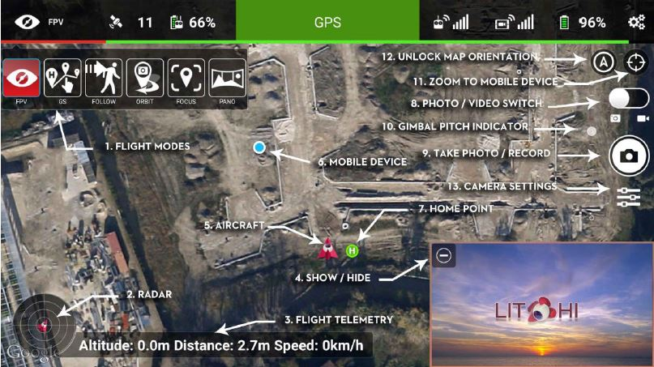
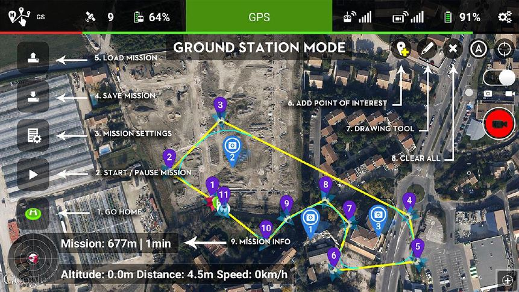

# Drone Project Thesis
_Author: Daniel Cheng_ 
_Date: 9/2/17 to 9/17/17_

[//]: # (better name based off of thesis?)

## Project Brainstorming

## Initial Timeline / Sprint Plan
initial take photo and save to site

## Existing App Evaluation / Magic Quadrant
__Objective__: Find existing software / apps with the following capabilities:
1. Automate flying missions
2. Cache photos
3. Enable triggering for FLY NOW feature
+image quality/focusing 
+image size, etc.
+posting to SFTP (move these to the SDK section?)

[//]: # (check spelling, cost, system availability)
### Dimensions:
* Logistics: Cost, system availability (= color)
* Target Audience (Enterprise vs Hobbyist)
* Similar to surveying/photogrammetry vs flying custom missions and active tracking for own

### Native DJI Go4 App

Features Supported
* Automatic caching of photos
* Good focus / image quality

Missing Features
* __Mission  Automation__: 

### Hobbyist Apps for Recreation
These apps target single user consumer flying drones primarily for personal recreation. 

Their interface is very similar to the native DJI Go4 App (in essence they've provided an extra UI layer for further customization off of the DJI SDK). 
purely for recreation. They enhance the automation section (what's that called??) in the app (such as Follow Me, Active Track, Waypoint Missions, Orbit, and Panorama). For example, for the waypoint missions, these apps allow you to mark destinations on a map, then convert these into a drone mission--unlike the DJI Go4 App which requires you to fly the drone through all these destinations before rerunning.

In increasing order of both cost and customizability:
1. Airnest 
2. DJI Ultimate Flight
3. Litchi
4. Autopilot

__Airnest__ 
Airnest markets themselves as "simply and easy to use" with a "Photostop style" interface. For example, for waypoint missions, the app allows users to simply "paint a line" on a map, and the app converts that into mission instructions for the drone.

In my user tests, the app unfortunately failed to live up to its promise of being extraordinarily simple and easy to use. Missions could indeed be drawn with the flick of a finger, but editing those missions proved nearly impossible. For example, when I attempted to move the auto generated waypoint, I could literally find only one exact pixel spot where the app would respond to my touch.

However, Airnest is free to use and functions as a convenient starter entry app for those wishing for a more flexible mission automation tool.

__DJI Ultimate Flight and Litchi__ 
These next two apps offer very similar features, with DJI Ultimate Flight coming in at $20, and Litchi at $20-25 depending on the system. Litchi is by far the most popular hobbyist drone app when browsing forums and drone enthusiast sites, and for good reason. 

Both apps have very similar layouts to the DJI Go4 App, with a first-person video stream in front, camera options on the side, and toggling options for camera settings, waypoint behavior, etc.

Litchi allows users to create far more customized automated missions than would be possible in the native DJI app. This includes:
* Taking pictures (single shot and timed shot) at a waypoint
* Recording video at a waypoint
* Rotating the gimbal to focus on a point of interest 
* Pausing and hovering at a waypoint

All of these actions are programmatically tied to a waypoint, and a series of waypoints are then joined to together to run as an automated mission. Users simply tap to create a waypoint, then tap again to toggle the various actions for each waypoint. The series of waypoints are then uploaded as a missiont to the drone. All that's left is to hit "Run Mission" and the app will fly the drone from start to finish!

 

A couple differentiating features between the two:
Additional features
* Litchi Mission Planning hub
* DJI panoramas and orbits during waypoint missions 

__Autopilot__ 
This is the most advanced hobbyist app on the market. Users can precisely control every aspect of automated drone flight, from the exact camera angle and focus to the curvature and descent of flight between waypoints. 

The priciest of all these  apps ($29.95), Autopilot is ideally suited for those who need advanced automated flight control beyond what Litchi and DJI Ultimate Flight can offer. The learning curve is steeper due to the increased complexity offered for mission planning.

### Enterprise Apps for Surveyance
These apps diverge from the native DJI UI--while they do provide flight automation, the app itself is a tool, a means towards an end. 
That end is photogrammetry--generating a high-resolution or even 3D model via scores and hundreds of drone pictures. Hence these apps tend to target professional or enterprise customers who are willing to pay more for the photo editing tool on the backend. And who need an app that will fly hundreds of missions over a large area.
 
Again, in increasing order of complexity and cost:
1. Flying Precision
2. Pix4D
3. Drone Deploy

__Flying Precision__ 
Deployed by Precision Hawk, this free app offers a very simple front-end interface. Simply touch and drag to mark the survey area on the map, the app will automatically generate a waypoint mission to fly. There are no additional capabilities for customizing camera focus or gimbal rotation--the app simply flies the drone over the desired area and automatically captures however images are needed for generating a detailed high-resolution image of the area.

__Pix4D__ 
Another free app, Pix4D offers more customization than Flying Precision. For example, several different missions can be flown, including grid, criss cross, orbit, and panorama.

[//]: # (screenshot)

Users can also customize the angle of the gimbal and the rate of capture. Missions can be grouped into higher level "projects", and all photos are locally cached to corresponding subfolders within the phone's internal storage. 

Everything in the app is geared towards the post-processing "photogrammetry" stage. Upon photo download, all images can be automatically uploaded to Pix4D cloud servers, which are then stitched together to construct a 3D model of the surveyed landscape.

In the words of one of the supported reps that I contacted regarding this app:
> Pix4Dcapture is a great flight planning app we provide free [but] you are free to use other applications if they better suit your needs. It is our Pix4Dmapper software that is the premier solution for photogrammetry, and as long as you are able to capture your images with the correct overlap and quality, you can process with Pix4Dmapper. 

__Drone Deploy__ 
By far the most complex and costly of all three (coming in at $99 _per month(!)_), Drone Deploy clearly targets enterprise customers. Upon first opening the app, you're taken to a farming demo mission showcasing the app's ability to survey and model a large swatch of farmland in the Midwest.

Other touted features include:
* Analysis of # of batteries needed for flight
* Automatic continuation of a mission should it be aborted midway through

### Logistics 
_Cost_

_System Availibility_

### Justification/Result of App Evaluation 
None of the existing app could fulfill the minimum criteria necessary for this drone product.

Litchi came closest with its mission planning interface and automated flights, but failed to offer photo caching--essential for immediate display of images on the web service.

Pix4D was a close second since it automatically streamed images to the phone upon completion of the mission, but its mission planning was quite rigid. Because the app functioned as a means towards surveying a region, the quality and rate of image capture was automated and locked away in a black box--hence you had no ability to customize taking pictures at different angles and speeds. 

Finally, none of the apps offered a way to automatically trigger a mission through a different medium (e.g. SMS). Ultimately you would still have to manually press a button to start the mission.

## SDK Exploration
### Criteria for Minimum Viable Product 
Developing a full-fledge app similar to Litchi would take far longer than a few days, hence I had to identify the exact functions that my custom app would have to perform to complete the drone product. 

_Features Available in Existing Apps_ 
* __Mission Automation__: One button to take off from ground, fly to waypoints, take photos, and land 
* __Photo Caching__: Photos should automatically be saved on phone internal storage 
* __Image Focus/Quality__: Camera should auto focus and expose throughout to avoid blurriness and low-resolution images  

_New Features_  
Scheduled Missions:
Triggered Missions:
Photo Compression:
Photo Transfer:

### Initial Exploration of SDK
Before jumping into coding all of these functions, I first determined whether the existing mobile SDK could indeed achieve each of the minimum criteria listed above. Otherwise, an alternative to the SDK would have to be used should any of the above features seem infeasible during this exploration stage.

Feature | SDK Class | SDK Method
------- | --------- | ----------
Mission Automation | MissionBuilder | addWaypoint, addAction, loadMission, startMission 
Photo Caching | MediaManager | onNewFile, fetchFileData
Image Quality | Camera | setFocusmode

Feature | Android Package
------- | ---------------
Scheduled Missions | Timer
Triggered Missions | BroadcastReceiver / SMS Manager
Photo Compression | ImageUtil
Photo Transfer| JSch

## Android App Development
### Initial Build (Alpha)
I had two options for learning Android app development:
1. Ground-up Approach: Watch tutorial videos, learn Android basics, test out a sample app
2. Copy and Modify: 

The first option would be preferable for building a stronger foundation for undersatnding Android architecture (far different from say, the architecture of a desktop Java app). However, with only 3 days allocated for app development, I chose the second option. I identified a [QuickStart Guide](https://developer.dji.com/mobile-sdk/documentation/quick-start/index.html) for connecting a custom mobile app to a DJI drone, then copied the [tutorial code](https://developer.dji.com/mobile-sdk/documentation/android-tutorials/index.html). Rather than spending my limited time understanding how to setup product registration, drone connectivity, and basic live-camera streaming, I utilized the existing tutorial app and focused on building each of the minimum viable features listed up above.

__Day 1__
 [x] Compile and run tutorials 
 [x] Set up live video stream 
 [x] Create button to take a photo during drone flight
 [x] Troubleshoot Android permissions on Marshmallow 

__Day 2__:  
 [x] Programmatically set autofocus 
 [x] Automatically take off
 [x] Automatically land 
 [x] Download photos to internal storage 

__Day 3__:
 [x] Add waypoints based on GPS coordinates
 [x] Add custom actions at each waypoint (start timed shot, rotate gimbal, etc.) 
 [x] Upload multiple waypoints as one mission to the flight controller 

__Day 4__:
 [x] Test complete execution of mission with automatic timed shots 
 [x] Create button to trigger mission every 5/10/15 minutes 
 [x] Resize images from 5 MB to 0.2 MB 
 [x] Post resized images to EC2 server backend 

__Day 5__:
 [x] Create button to listen for SMS trigger for kicking off mission 
 [x] Automatically save photos in timestamped mission folder (locally and on server)
 [x] Test complete execution of mission with automatic resize and upload to server 
 

### App Troubleshooting / Hardest Problems
* Marshmallow permissions 
* Download bandwidth 
* Scheduling waypoint missions 
* SCP transfer
   * how to transfer quickly 
   * notify other system complete 
   
### Other Technical Learnings 
* Android Studio/Gradle
* DJI Assistant/Simulator
* ADB Logging Tools
* Java Concepts
   * Enums
   * Builders 
   * Callbacks
   * Implementing and extending 
   * Synchronizing / multithreading 
* Android Concepts
   * Android Life Cycle (onPause, onResume, onDestroy, etc.)
   * Multithreading (UI thread, main thread, etc.)
   * Broadcast receiver and intent filters
   * Permissions 
   
## Web Service

## Final Architecture
__Android App__ 
* Image Resize
* ScpTo
* SMS Processor
* Custom exceptions
* Waypoint mission flying
* Live video feed

## Future Work

